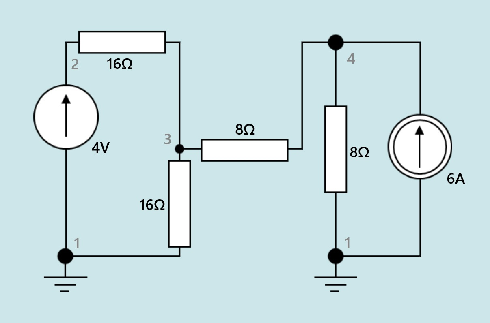
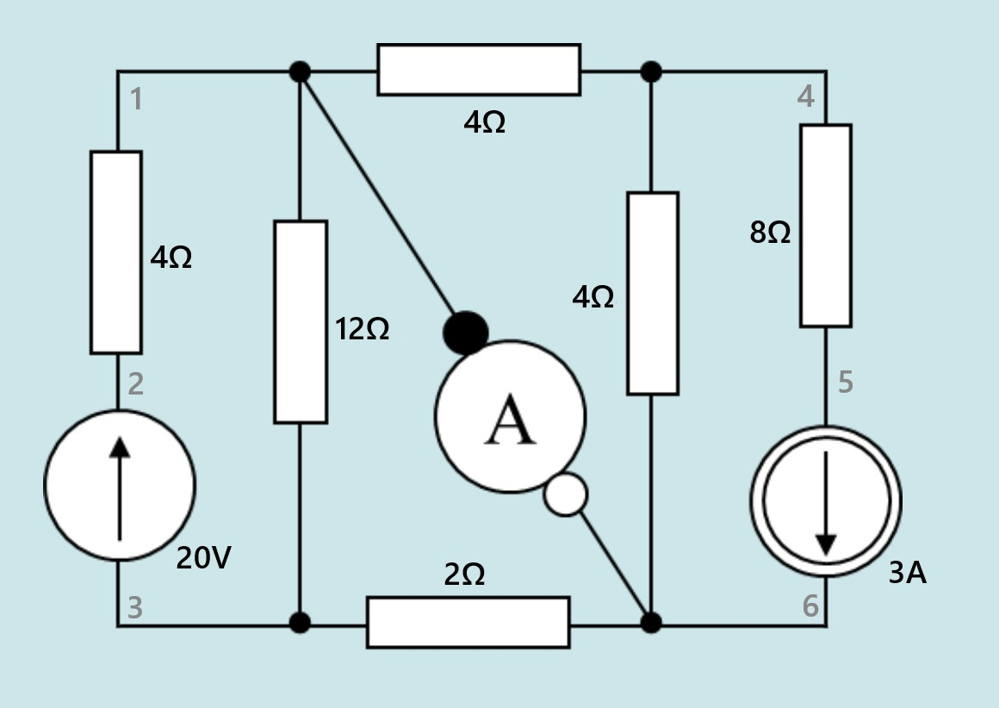
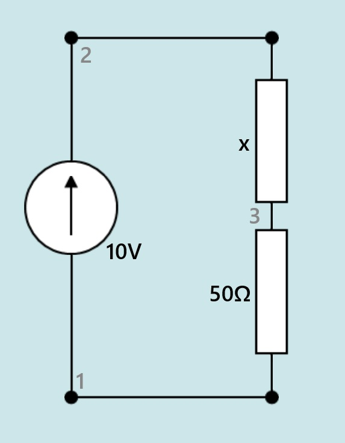
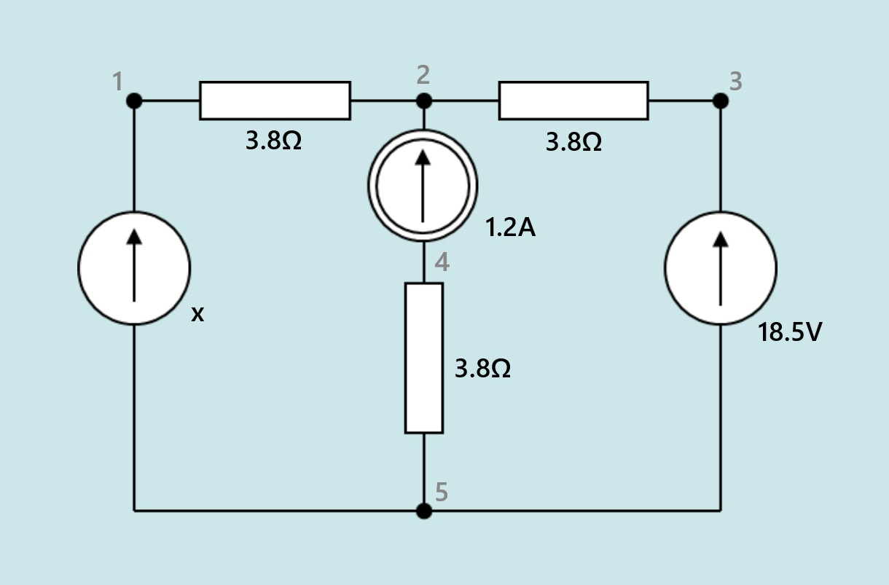
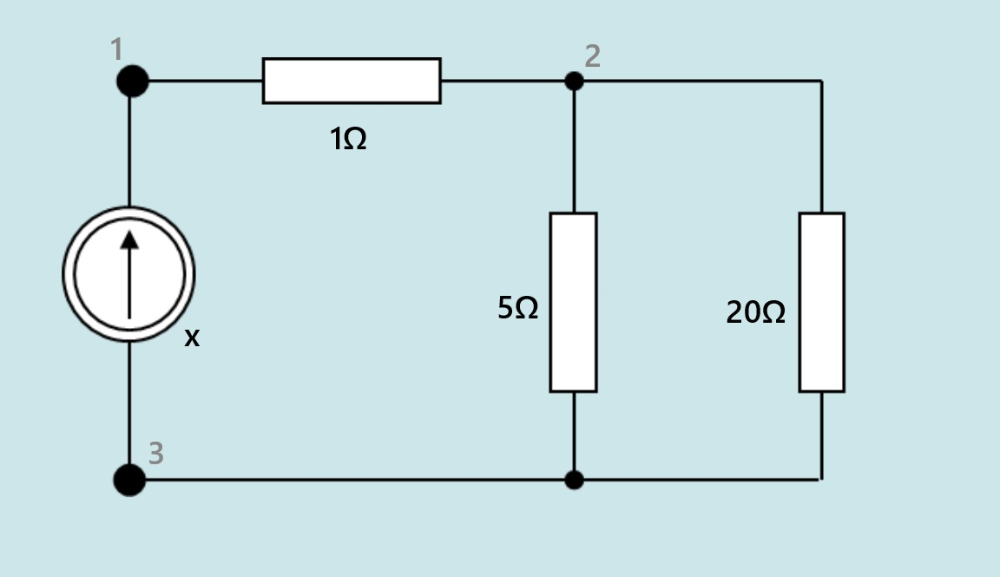

# ALDCC Simulator

ALDCCsim is a C++ command-line tool designed to solve linear electrical circuits using Modified Nodal Analysis (MNA). The solver supports resistors, independent voltage sources, and independent current sources. It also features a bisection-based optimization engine to find specific component values required to achieve a desired circuit output (voltage, current, or power).

### Below is a shorter description of the program made for users. The original task description, analysis of the problem as well as internal specification and testing can be found in:
<div class="my_center"> <div class="my_fragment"> docs/detailed_description.md </div> </div>

## Features

1. **Modified Nodal Analysis (MNA)**: Handles both voltage and current sources by expanding the nodal matrix.
2. **Bisection Engine**: Automatically determines the required value of a "variable" component to meet a target output.
3. **Robust Linear Solver**: Uses Gaussian elimination with partial pivoting for numerical stability.
4. **Error Detection**: Identifies invalid circuit topologies, such as parallel voltage sources or indeterminate nodes.
5. **Customizable Precision**: Configurable output precision for scientific and engineering requirements.

## Usage

### Command Line Arguments
```shell
./ALDCCsim -i <input_file> -o <output_file> -p <precision>
```
`-i`: Path to the input circuit file. <br>
`-o`: Path where results will be saved. <br>
`-p`: (optional) Number of decimal places for rounding (default: 4).

The program has two modes of operation that are determined by the program internally based on contents of the input file:
### Basic mode
#### Input
Each line of the input file should contain one [element](@ref Element) along with nodes to which it is connected and a value.
```
<Type> <Node1> <Node2> <Value>
```
A node is every tree of wires separated from other nodes with elements. Nodes should be numbered arbitrarily starting from 1.
> Note: A value is assumed to be given in SI units and its unit corresponds to the given element type.<br>
> Example: `E 1 2 4` stands for `voltage source directed from node 1 to node 2 with value 4`

> Note: The order of nodes is important for specifying in which direction sources are placed. They are directed from the first node towards the second. This order is also important in how results are presented. (see [sign convention](#sign-convention))

[Element types](@ref ElementType):
- **E** denotes a voltage source
- **J** denotes a current source
- **R** denotes a resistor

#### Example Input


```
E 1 2 4
R 2 3 16
R 1 3 16
R 3 4 8
R 1 4 8
J 1 4 6
```
> Note: Because we marked the ground node on the left as node `1`, we can do the same on the right - they are effectively the same node.
---

```
R 2 1 4
E 3 2 20
R 3 1 12
R 1 4 4
E 1 6 0
R 3 6 2
R 6 4 4
R 5 4 8
J 5 6 3
```
> Note: In this circuit we can model an ideal ammeter using a `0V` voltage source.

### Search Mode (Bisection)
The simulator enters **Search Mode** when it detects a variable element and a target output value in the input file. This mode utilizes a bisection-based optimization engine to find the specific component value required to achieve a desired circuit state.

#### Input

To use the simulator in this mode, one element must have its value replaced with an `x` symbol, and a target condition must be specified.
The rest of the input file format is unchanged between [basic mode](#basic-mode) and search mode.

Variable element (exactly one should be present):
```
<Type> <Node1> <Node2> x
```

Target condition (can be specified alongside any element to which it should apply) (exactly one should be present):
```
<ValueType> <DesiredValue>
```

- **Variable Element**: Only one element in the circuit can be marked as variable using `x`.
- **Value Type**: Voltage `U`, Current `I`, or Power `P`.
- **Desired Value**: Value of voltage, current or power that the simulator will try to reach on this element (do **not** place units - SI units are assumed).
- **Voltage (`U`)**: Target voltage across an element.
- **Current (`I`)**: Target current through an element.
- **Power (`P`)**: Target power dissipated/supplied(depending on the sign) by an element.

> Example: `E 1 2 30 P 10`. First 4 values specify the element (see [input](#input)) and 'P 10' define how much power is supposed to be supplied/absorbed (see [sign convention](#sign-convention)) by this element.

> Note: Variable element and the element with desired value specified can be the same element (see the third example below)

#### Example Bisection Input

```
E 1 2 10
R 2 3 x
R 3 1 50 U 5
```
In this example, the simulator will find the resistance of the resistor between nodes 3 and 1 that results in exactly 5V voltage across nodes 3 and 1.

---

```
E 5 1 x
R 1 2 3.8
R 2 3 3.8
J 4 2 1.2
R 5 4 3.8
E 5 3 18.5 P 4.9
```
The simulator will find the value of the voltage source between nodes 5 and 1 that results in 4.9W of power being supplied by the other voltage source (between nodes 5 and 3).

---

```
J 3 1 x P 5.5
R 1 2 1
R 2 3 5
R 2 3 20
```
The simulator will find the value of the current source between nodes 3 and 1 that results in 5.5W of power being supplied by it.

---

### Output

The simulation results are written to the specified output file with the following sections:

1. **Bisection Result**: If bisection was performed, the final calculated value for the variable element is displayed.
2. **Element Table**: A formatted table showing Voltage `U`, Current `I`, and Power `P` for every component.
3. **Node Potentials**: A list of the calculated potentials `V` for every node in the circuit (with node 1 always chosen as ground node).

Values are rounded according to the specified precision (default: 4).

#### Sign Convention

Values given in the **Element Table** are given in accordance to **passive sign convention** for **resistors** and **active sign convention** for **sources**.
Each element's current is positive if it flows in the direction from the first node to the second. 

> Example: If an element is described in the input file in the following way: `R 4 3 1.5`,
> the simulator will output its curent as **positive** if it flows **from node `4` to node `3`**.

---

### Implementation Details

#### 1. Modified Nodal Analysis (MNA)

The solver constructs an augmented matrix `Ax = b`, where:
- `A` contains coefficients representing conductance values and voltage stamps.
- `x` is the vector of unknown node potentials and voltage source currents.
- `b` contains known source values.

#### 2. Equation Solver

Gaussian elimination is performed on the matrix equation in order to solve for potentials and voltage source currents.

#### 3. Bisection Algorithm

The optimization process follows these steps:

1. **Derivative Sign Detection**: The simulator perturbs the variable element by a small value to determine if the output increases or decreases.
2. **Bound Finding**: It iteratively doubles the search range until the desired value is bracketed.
3. **Iteration**: The solver performs 50 iterations ([BISECTION_PREC](@ref constants::BISECTION_PREC)) to converge on the final component value with high precision.

#### 4. Error Handling and Validation

The program performs several topological checks before solving:

- **Current Source Only Nodes**: Detects nodes connected only to current sources, which makes voltage indeterminate.
- **Parallel Voltage Sources**: Identifies illegal parallel voltage source configurations that would lead to indeterminate branch currents.
- **Contradictory Equations**: Throws an error during Gaussian elimination if the circuit description leads to an unsolvable system.


